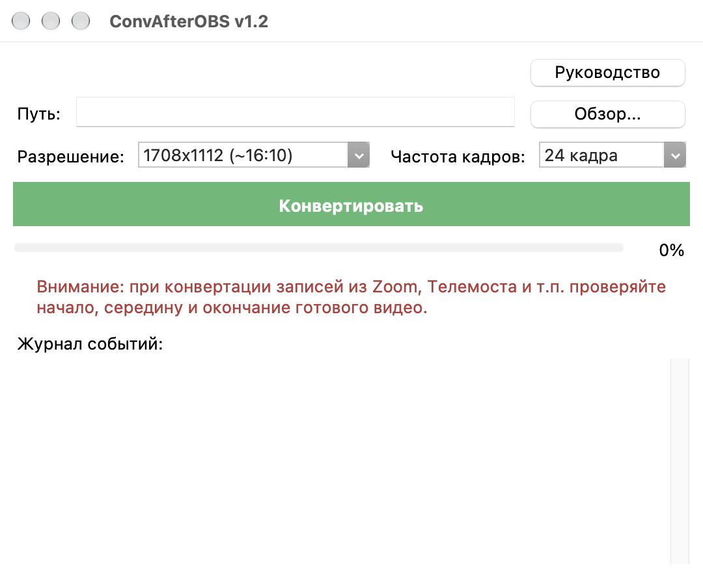

# 🎬 ConvAfterOBS

[](LICENSE)
[](https://www.python.org/)
[](https://ffmpeg.org/)
[](https://docs.python.org/3/library/tkinter.html)
[](https://github.com/git-sudo-ai/ConvAfterOBS)

**ConvAfterOBS** — легковесная, быстрая и надёжная десктопная утилита для постобработки и сжатия видеозаписей из **OBS Studio**, **Zoom**, **Яндекс Телемоста** и других программ захвата экрана.

Программа оптимизирует «тяжёлые» исходники, уменьшая размер файлов в несколько раз без видимой потери качества за счёт выверенных настроек кодека H.264 и аудио-профиля.

---

## 📸 Интерфейс программы

<p align="center">
  
</p>

---

## ✨ Основные возможности

- **Умная предварительная оценка**: перед началом полной конвертации утилита делает три 60-секундных среза (на 25%, 50% и 75% хронометража) и рассчитывает прогнозируемый размер готового видео. Если сжатие нецелесообразно (файл получится тяжелее оригинала) — процесс автоматически отменяется для экономии времени и дискового пространства.
- **Оптимальные параметры сжатия**:
  - **Видео:** H.264 (`libx264`), CRF 26, пресет `medium`, пиксельный формат `yuv420p`.
  - **Аудио:** AAC 64k моно с автоматической синхронизацией временных меток (`aresample=async=1000`).
  - **Быстрый веб-старт (`+faststart`):** перемещение метаданных (moov atom) в начало файла для мгновенного онлайн-воспроизведения без необходимости предварительного скачивания всего видео.
- **Поддержка разрешений и частоты кадров**:
  - `1708x1112 (~16:10)` (оптимально для экранов MacBook Pro 14")
  - `1920x1080 (16:9)` (Full HD)
  - Частота кадров: `24 кадра` / `60 кадров`.
- **Наглядный мониторинг прогресса**:
  - Прогресс-бар и процент выполнения в реальном времени.
  - Процент выполнения транслируется прямо в заголовок окна (видно в Dock macOS и на панели задач Windows).
- **Надёжность и безопасность данных**:
  - Атомарная запись через изолированный временный файл с безопасной заменой.
  - Запоминание директории последнего выбора файла.
  - Поддержка запуска и Drag-and-Drop через аргументы командной строки (`sys.argv[1]`).
- **Интегрированное руководство пользователя**: встроенная справка по установке и настройке FFmpeg в один клик с готовыми командами для копирования.
- **Нулевой оверхед по зависимостям (0 сторонних pip-пакетов)**: работает исключительно на стандартной библиотеке Python (`tkinter`, `subprocess`, `threading`, `tempfile`).

---

## ⚙️ Требования

1. **Python 3.8+**
2. **FFmpeg** и **ffprobe** в системном `PATH`.

---

## 🚀 Установка и запуск

### Быстрый запуск:
```bash
python3 ConvAfterOBS.py
```

### Запуск с передачей файла (или через Drag-and-Drop):
```bash
python3 ConvAfterOBS.py /путь/к/видеофайлу.mp4
```

---

## 📦 Установка FFmpeg

- **macOS (через Homebrew)**:
  ```bash
  brew install ffmpeg
  ```
- **Windows (через Winget)**:
  ```powershell
  winget install Gyan.FFmpeg
  ```
- **Linux (Debian / Ubuntu)**:
  ```bash
  sudo apt update && sudo apt install ffmpeg
  ```

---

## 📜 Лицензия (License)

Проект распространяется под строгой копилефтной лицензией **GNU General Public License v3.0 (GPL-3.0)**.

> Любое использование, модификация или включение кода ConvAfterOBS в производные проекты **обязывает** распространять производный проект на условиях открытого исходного кода (Open Source) под той же лицензией GPL-3.0. Закрытие исходного кода или превращение в проприетарный продукт запрещено условиями лицензии.

Подробный текст лицензии доступен в файле [LICENSE](LICENSE).

---

## 🤝 Поддержка и автор

- Автор: **Michiru**
- Telegram: [@sudo_ai](https://t.me/sudo_ai)
- GitHub: [@git-sudo-ai](https://github.com/git-sudo-ai)
